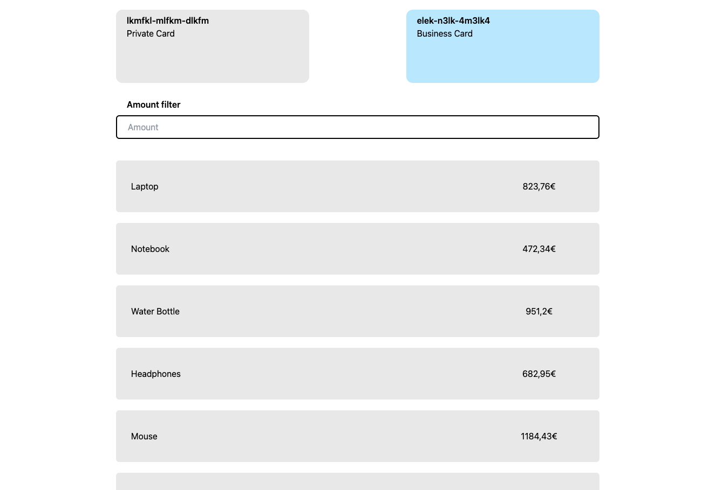
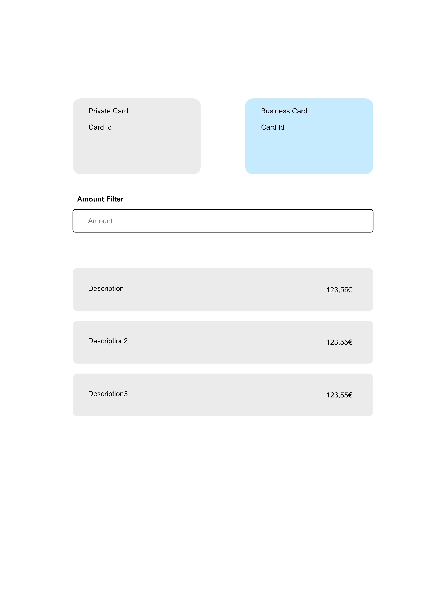

# Daniele Rapisarda's Web Cards Transactions

This is the Daniele Rapisarda implementation of a technical assignment, during the recruitment
process for a position as [Senior Frontend Developer at DKB Code Factory](https://boards.greenhouse.io/dkbcodefactory/jobs/4124790003)



## Task

The purpose of this task is to build a card and transactions overview page. The user should be able to select one of the cards, see it's transactions and be able to filter the transactions based on the amount.

You will find an image in the folder /docs, it gives a visual overview of how the page is intended to look like.

## AC

- User can select one of the cards
- The transactions of the selected card will be displayed.
- The transactions have a same background color than the card.
- There should be a filter field between the cards and the transactions.
- The user can filter transactions by inputting amount to the filter fields. Transactions with the amount in the fields or greater should be left visible.
- If the user changes a selected card and there is content in the filter fields, the content should be resetted.



## Solution

My implementation encapsulates the logic of the App in the App.vue file. It manages the state and the user interactions.

## Notable implementations, other then the ACs

### Fake Api Calls

In the _getCards_ and _getTransactions_ composables, the API calls are simulated.

### Loading/Latency UI

A fake latency of 2 seconds allows to show the UI during network latency. During the API call latency time, the TransactionContent and BankCard components are displayed as placeholders.


### Virtual Scrolling

Virtual scrolling is implemented for efficient rendering of TransactionContent components.
This approach significantly improves performance when dealing with large lists of transactions.

### Tests and Coverage

The unit tests provide 100% coverage for the composables and components, ensuring thorough testing of individual units. Additionally, most of the App.vue's lines are covered by these tests. To validate the expected user journeys and overall functionality, end-to-end tests have been implemented using Cypress.js. These tests simulate real user interactions and verify that the application behaves correctly in various scenarios.

## Requirements

This project is made to run in a [NodeJs v20.10.0 environment](https://nodejs.org/en/download/package-manager).

## Project Setup

```sh
yarn
```

### Compile and Hot-Reload for Development

```sh
yarn dev
```

### Type-Check, Compile and Minify for Production

```sh
yarn build
```

### Run Unit Tests with [Vitest](https://vitest.dev/)

```sh
yarn test:unit
```

### Run End-to-End Tests with [Cypress](https://www.cypress.io/)

```sh
yarn test:e2e:dev
```

This runs the end-to-end tests against the Vite development server.
It is much faster than the production build.

But it's still recommended to test the production build with `test:e2e` before deploying (e.g. in CI environments):

```sh
yarn build
yarn test:e2e
```

### Lint with [ESLint](https://eslint.org/)

```sh
yarn lint
```

### Format with [Prettier](https://prettier.io/)

```sh
yarn format
```
